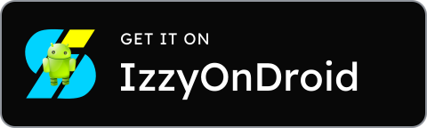
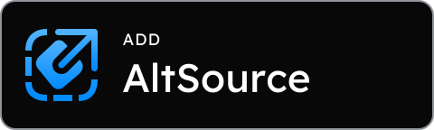

# Download badges

One family for GitHub, IzzyOnDroid, Google Play, App Store, AltSource and direct IPA downloads.
The existing PNG filenames remain stable; `app-store.png` replaces the formerly remote badge.

| GitHub | IzzyOnDroid | Google Play |
|---|---|---|
|  |  |  |
| **App Store** | **AltSource** | **IPA** |
|  |  |  |

## Shared geometry

Every SVG has `viewBox="0 0 240 72"` and intrinsic dimensions **480 × 144**; every PNG is also
**480 × 144**. The PNGs cover a 160 × 48 display at 3× density. Current consumers display them at
140px (README) or 150px (release notes) wide. Set the same width and preserve the aspect ratio.
Release-note image URLs are pinned to the source checkout's commit, so rerunning an existing
version includes its current artwork without changing old image URLs.
There is no outer transparent padding; only the rounded corners are transparent. Keep spacing
between buttons in the surrounding layout.

All geometry below uses SVG viewBox units:

| Property | Shared value |
|---|---|
| Plate | x/y 0.5; width 239; height 71; fill `#080808` |
| Border | 1; `#91959C` |
| Corner radius | 8 |
| Icon slot | x 14; y 16; 40 × 40; proportionally fitted and centred |
| Text left ink edge | 68 |
| Header | Lexend 400; size 9; tracking 0.5; baseline 25 |
| Title | Lexend 450; size 22; baseline 51 |
| Right text limit | 226 |

The plates and PNG alpha channels match exactly. Brand marks retain their natural proportions
inside the shared slot. Titles keep one font size even when their lengths differ.

## Rebuild

Edit `generate.py` for layout/copy, or `marks/*.svg` for a mark, then run from the repository root:

```sh
# Requires uv and librsvg's rsvg-convert (Homebrew: brew install librsvg).
uv run art/badges/generate.py
```

The script pins FontTools through its inline dependency metadata. It reads the existing
`shared/src/commonMain/composeResources/font/Lexend_variable.ttf`, outlines the type into each
standalone SVG, then renders each PNG with librsvg. SVGs contain no font dependency, script,
remote image or external stylesheet. Commit the generator/marks and regenerated SVG/PNG pairs
together. Rebuilding does not contact brand websites.

## Mark sources

- GitHub: `GitHub Logos/SVG/GitHub_Invertocat_White.svg` from the
  [official logo archive](https://brand.github.com/GitHub_Logos.zip). The visible path is preserved.
- Apple: the two Apple-mark paths from the
  [official badge previously used by the README](https://developer.apple.com/assets/elements/icons/download-on-the-app-store/download-on-the-app-store.svg).
- IzzyOnDroid: [official logo](https://codeberg.org/IzzyOnDroid/assets/raw/branch/main/IzzyOnDroidLogo.svg),
  [source and usage terms](https://codeberg.org/IzzyOnDroid/assets/raw/branch/main/README.md).
  Upstream combines vector shapes with a raster Android mascot. This set preserves those shapes
  and embeds a proportionally reduced 128 × 128 mascot, sufficient for its roughly 50px rendered
  size in the PNG. **This mark is not entirely vector.** The SVG remains self-contained.
- Google Play, IPA and AltSource: compact vector redraws of the marks in the previous local
  `google-play.png`, `Download_Blue.png` and `AltSource_Blue.png` respectively.

These are custom Synkplay download buttons using the respective brand marks, with a shared
layout and type system. Original local badges remain recoverable through Git history.
